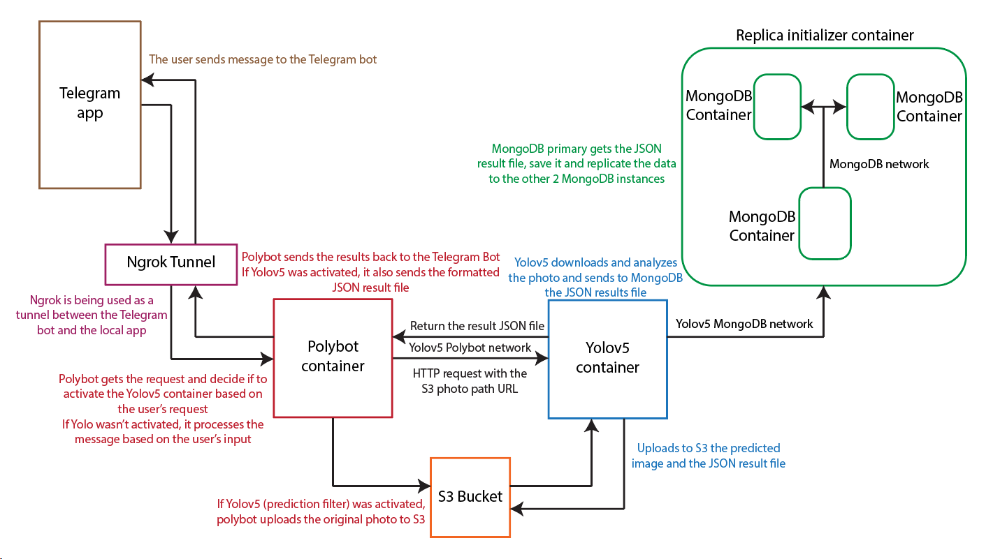

# Docker Project

In this project, I took the python project I did and expend it.  
I utilized containers to deploy the Python application alongside additional functionalities, storing the data received in a MongoDB database.
(Python project https://github.com/Yaelwil/ImageProcessingService)

## Ngrok Tunnel

I used Ngrok to expose a local server to the internet securely through a secure tunnel. 

## MongoDB Initialization

Initially, I established a MongoDB replica set comprising three containers. This setup involved configuring the docker-compose.yaml file to define the three MongoDB containers and initializing the replica set via another container.

## Polybot Container

Next, I deployed the Polybot container responsible for managing the bot's logic. Within the filters section, I introduced a "predict" filter aimed at recognizing characters and returning the results.

Files Worked On:
- Dockerfile: Created to encapsulate the container's requirements.
- app.py: Required no modifications; contains URL endpoints and invokes the ImageProcessingBot method.
- bot.py: Partially edited to define the bot's behavior.
- detect_filters.py (added to project): Developed to handle the prediction function.
- filters.py: Developed to manage filter selection based on user photo captions.
- img_proc.py: Primarily edited to implement filter logic.
- responses.json: Houses potential response sentences for user input.
- responses.py: Imports response data into the project.
- requirements.txt: Specifies project dependencies.

## YOLOv5 Container

Finally, I deployed a YOLOv5 container to enable object detection. The prediction code sourced from a GitHub repository

Files Worked On:
- Dockerfile: Created to encapsulate the container's requirements.
- app.py: Partially edited the code, 
- requirements.txt: Specifies project dependencies.

## Operating Systems
-	Linux (Ubuntu).

## Programming Languages
- Python Scripting.

## Version Control
- GitHub.

## Cloud
- AWS.

## Web Servers
- Nginx.

## Containers
- Docker hub.

##  Automation and Configuration Management:
- YAML.
- JSON.

## Continuous Integration Continuous Development:
- Introduction to CI/CD.
